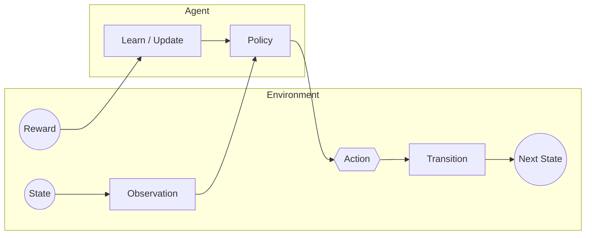
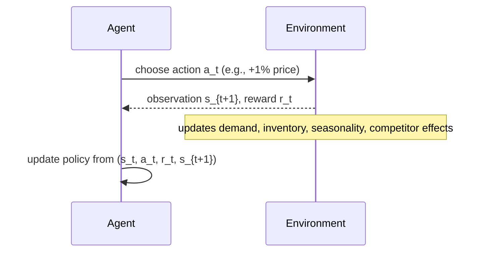
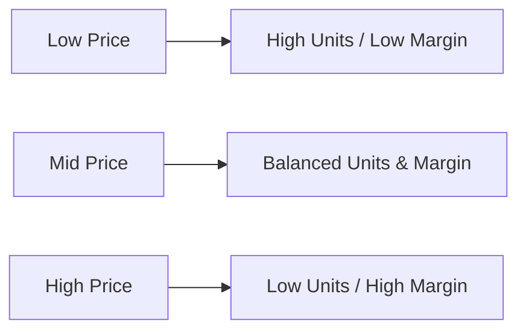

# Phase 0 Primer — Dynamic Pricing RL (Beginner-Friendly)

This one-pager gives you a plain-English mental model of **dynamic pricing** and **reinforcement learning (RL)** before we write any code. 

---

## 1) What problem are we solving? (Dynamic Pricing)
You run an online store. Each day you can tweak the **price** of a product. Changing price affects **demand**, which affects **revenue** and **profit**. You also have **inventory** (can stock out) and **competitors** (their prices influence demand).

**Goal:** Pick a price each day to **maximize profit over time**, not just today.

### Key real-world factors
- **Elasticity** (how sensitive demand is to price)
- **Seasonality** (weekly/holiday patterns)
- **Competitor price** (relative pricing matters)
- **Inventory** (you can run out → lost sales or penalties)
- **Price constraints** (floors, ceilings, fairness/safety rules)

---

## 2) Reinforcement Learning (RL): The idea
An **agent** (our pricing policy) repeatedly interacts with an **environment** (the marketplace). The agent observes the **state**, chooses an **action** (e.g., +1% price), gets a **reward** (profit), and the environment **transitions** to a new state. Over many episodes, the agent learns a policy that maximizes **expected cumulative reward**.

### RL Loop (at a glance)

```mermaid
flowchart LR
  subgraph Env[Environment]
    S((State)) --> O[Observation]
    A2{{Action}} --> T[Transition]
    T --> S2((Next State))
    R((Reward)):::reward
  end

  subgraph Agent
    O --> P[Policy π(a&#124;s)]
    P --> A2
    R --> L[Learn / Update]
    L --> P
  end

  classDef reward fill:#fff3cd,stroke:#e0a800,color:#000;
```
```mermaid
flowchart LR
    subgraph Environment
      S[(State)] -->|reveals| O[Observation]
      A{Action from Agent} --> T[Transition]
      T --> S2[(Next State)]
      R((Reward)):::reward
    end

    subgraph Agent
      O --> P[Policy π(a|s)]
      P --> A
      A -->|to env| Environment
      R -->|learn from| Agent
    end

    classDef reward fill:#fff3cd,stroke:#e0a800,color:#000;
```

**Translation:** Agent sees the world, picks a price move, earns profit, and updates its brain.

---

## 3) Dynamic Pricing as an MDP (simple view)
- **State** `s_t`: `[current_price, inventory, competitor_price, elasticity, day_norm]`
- **Action** `a_t`: `{-1%, 0%, +1%}` (tiny steps up/down/hold)
- **Transition**: environment updates day, demand, inventory
- **Reward** `r_t`: `profit = (price - unit_cost) * units_sold` (plus penalties, e.g., for stock-outs or volatility)
- **Objective**: maximize `E[Σ γ^t * r_t]` over the episode

### Agent–Environment Timing (one step)


---

## 4) Simple Demand Model (starter mental model)
We’ll begin with a **plain** analytic demand signal and add realism later:

- Base demand: `D0`
- Price elasticity (negative): `ε`
- Reference price: `p_ref`
- Price: `p`
- Seasonality factor: `S(t)` (e.g., a weekly curve from 0.8 to 1.2)
- Competitor effect: discount demand when `p > p_comp`

**Approximate units sold:**
```
units_sold(t) = clamp_by_inventory(
    D0 * (p / p_ref)^ε * S(t) * comp_adjustment(p, p_comp)
)
```
Where `comp_adjustment` down-weights demand if your price exceeds the competitor’s.

### Conceptual demand & profit (not to scale)

```mermaid
flowchart LR
    subgraph Demand_vs_Price
      P1[Low Price] -->|High Units / Low Margin| R1[Revenue]
      P2[Mid Price] -->|Balanced Units & Margin| R2[Revenue (Often Best)]:::best
      P3[High Price] -->|Low Units / High Margin| R3[Revenue]
    end

    classDef best fill:#e8f5e9,stroke:#43a047,color:#1b5e20;
```
*(We’ll plot real curves in Phase 1.)*

---

## 5) Project Roadmap (beginner → advanced)
1. **Baselines (no RL):** rules & grid search for profit-maximizing price.
2. **Contextual bandits:** one-step learning with side information (competitor, season).
3. **Tabular Q-learning:** tiny MDP with discretized states/actions.
4. **Gymnasium + RLlib (PPO):** continuous observations, scalable training.
5. **MLflow:** track metrics, params, and checkpoints.
6. **Docker & Kubernetes:** reproducible containers, scale-out training.
7. **CI/CD:** automated builds; optional gated deploys.

---

## 6) Glossary (plain English)
| Term | Simple meaning |
|---|---|
| State | What the agent sees about the world right now (price, inventory, etc.). |
| Action | The decision the agent makes (e.g., adjust price up/down/hold). |
| Reward | Immediate score (profit) earned after taking an action. |
| Policy | The agent’s strategy for picking actions given a state. |
| Episode | One full run (e.g., 60 “days” of pricing decisions). |
| Exploration | Trying options to learn, even if they seem worse now. |
| Exploitation | Using what looks best right now to get reward. |
| Discount (γ) | How much we value future rewards vs. now (0–1). |
| Checkpoint | Saved model parameters you can reload later. |

---

## 7) Safety & Constraints (important!)
- **Price floors/ceilings:** prevent unrealistic or unfair pricing.
- **Volatility penalties:** discourage wild price swings.
- **Stock-out penalties:** avoid running out early and losing future sales.
- **Evaluation under multiple scenarios:** stable vs. seasonal vs. competitor shocks.

---

## 8) What’s next (Phase 1)
- Implement simple baselines: rules & profit grid search.
- Plot demand/revenue/profit vs. price to build intuition.
- Compare baselines and document learnings.
